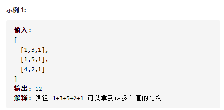

# 面试题47：礼物的最大价值



## 方法一：动态规划

1. 设 `f(i, j)` 为从棋盘左上角走至单元格 `(i ,j)` 的礼物最大累计价值
   * `f(i,j)`等于 `f(i,j-1)`和 `f(i-1,j)`中的较大值加上当前单元格礼物价值 `grid(i,j)` 。
   * `f(i,j)= max[f(i,j−1),f(i−1,j)]+grid(i,j)`  
2. **状态定义：**设动态规划矩阵 dp，`dp(i,j)`代表从棋盘的左上角开始，到达单元格 `(i,j)` 时能拿到礼物的最大累计价值。
3. **转移方程：**
   1. 当 i = 0且 j = 0时，为起始元素；
   2. 当 i = 0i=0 且 j !=0 时，为矩阵第一行元素，只可从左边到达；
   3. 当 i ! =0 且 j = 0 时，为矩阵第一列元素，只可从上边到达；
   4. 当 i !=0 且 j !=0 时，可从左边或上边到达；
4. **初始状态：**
   1.  `dp[0][0] = grid[0][0]`  
5.  **返回值：** 

   1. `dp[m-1][n-1]` 


```java
class Solution {
    public int maxValue(int[][] grid) {
        int row = grid.length;
        int col = grid[0].length;

        for(int i=0; i < row; i++){
            for(int j=0; j < col; j++){
                if(i == 0 && j == 0){ //初始位置
                    continue;
                }
                else if(i == 0 && j != 0){ //第一行
                    grid[i][j] += grid[i][j-1];
                }
                else if(j == 0 && i != 0){ //第一列
                    grid[i][j] += grid[i-1][j];
                }
                else{ //其他情况
                    grid[i][j] += Math.max(grid[i][j-1], grid[i-1][j]);
                }
            }
        }
        return grid[row-1][col-1];
    }
}
```

